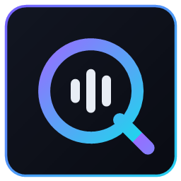
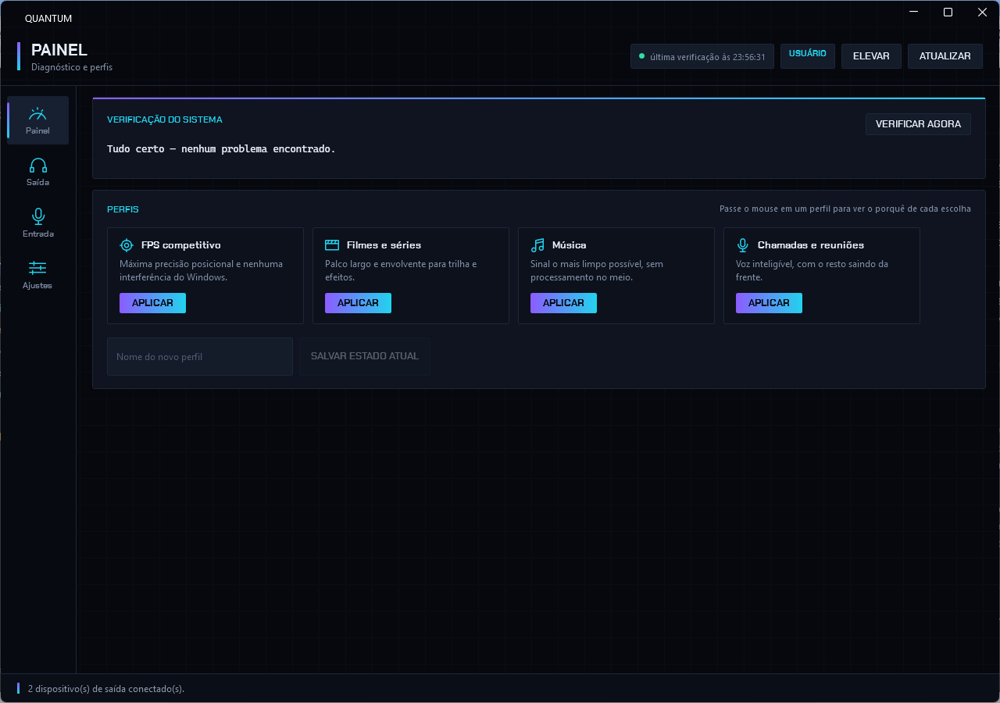
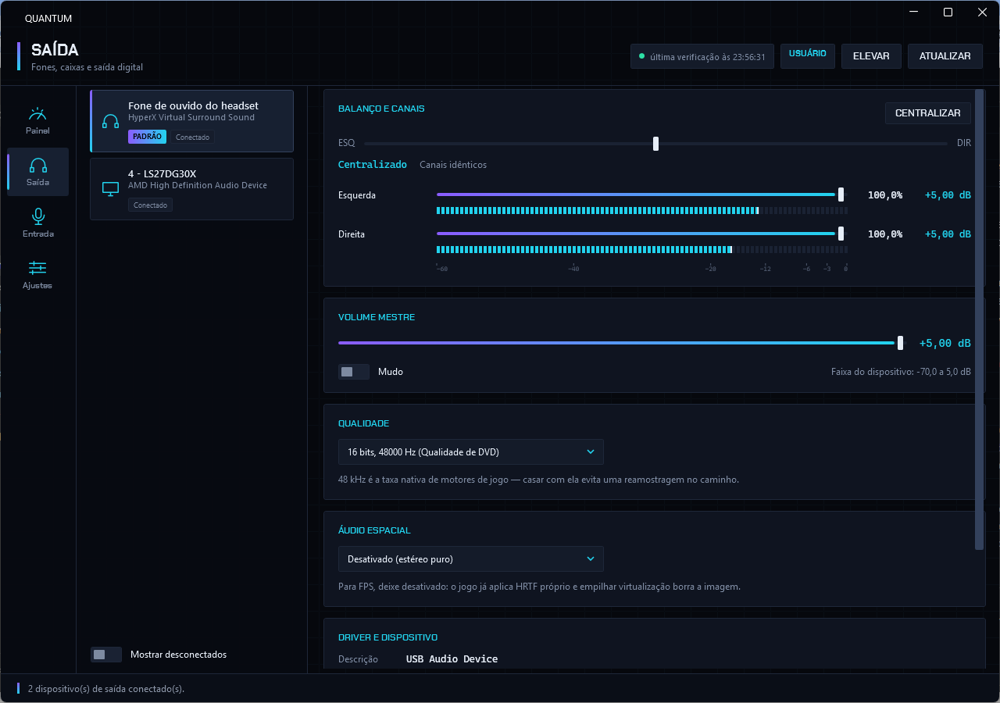
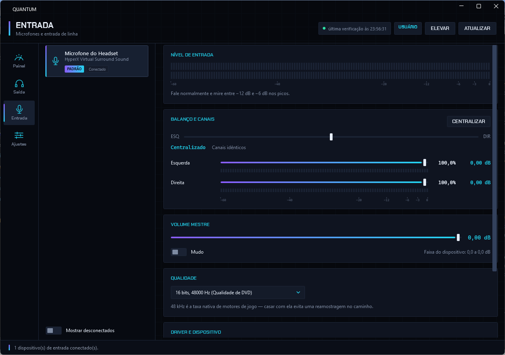
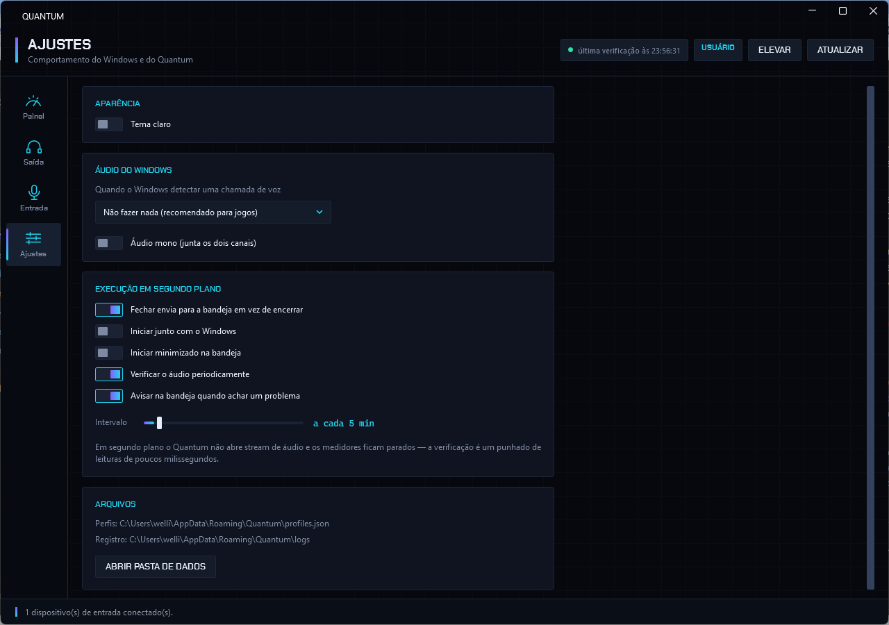

<div align="center">



# Quantum — Central de Áudio

**Balanço, canais em dB, microfone, qualidade, áudio espacial, driver e perfis — em um lugar só.**

[](https://github.com/net0well/Quantum/actions/workflows/ci.yml)
[](https://github.com/net0well/Quantum/actions/workflows/release.yml)
[](https://github.com/net0well/Quantum/releases/latest)
[](https://github.com/net0well/Quantum/releases)
[](LICENSE)

[**Baixar a última versão**](https://github.com/net0well/Quantum/releases/latest) · [Como usar](#como-usar) · [Configuração para FPS](#configuração-recomendada-para-fps) · [Desenvolvimento](#desenvolvimento)



</div>

---

## O problema que ele resolve

Um headset tocando praticamente só de um lado no PC — e perfeito no notebook.

A causa não era o fone nem o cabo: era o **balanço de canais do Windows** deslocado,
com a esquerda em 100% (+5,00 dB) e a direita em 20,3% (−20,00 dB). Vinte e cinco
decibéis de diferença. O ajuste fica escondido atrás de três cliques, é salvo por
dispositivo, e o Windows não dá nenhum sinal de que está torto.

O Quantum põe isso na primeira tela, mede em dB, avisa sozinho quando desregula e
corrige em um clique. E, já que estava lidando com a API de áudio, trouxe junto o
resto do que fica espalhado pelo painel do Windows.

---

## Índice

- [Instalação](#instalação)
- [Como usar](#como-usar)
  - [Escolher o dispositivo](#escolher-o-dispositivo)
  - [Verificação do sistema](#verificação-do-sistema)
  - [Perfis](#perfis)
  - [Balanço e canais](#balanço-e-canais)
  - [Volume mestre](#volume-mestre)
  - [Microfone](#microfone)
  - [Qualidade](#qualidade)
  - [Áudio espacial](#áudio-espacial)
  - [Driver e dispositivo](#driver-e-dispositivo)
  - [Sistema](#sistema)
  - [Aparência](#aparência)
  - [Segundo plano](#segundo-plano)
- [Quando precisa de administrador](#quando-precisa-de-administrador)
- [Configuração recomendada para FPS](#configuração-recomendada-para-fps)
- [Desenvolvimento](#desenvolvimento)
- [CI/CD](#cicd)
- [Notas técnicas](#notas-técnicas)
- [Limitações conhecidas](#limitações-conhecidas)

---

## Instalação

### Baixar pronto (recomendado)

1. Vá em [**Releases**](https://github.com/net0well/Quantum/releases/latest)
2. Baixe `Quantum.exe`
3. Execute

Não instala nada, não escreve no registro do sistema, não exige .NET. As únicas
coisas que ele grava ficam em `%APPDATA%\Quantum`.

> **Sobre o aviso do SmartScreen:** o executável não é assinado por certificado
> digital pago, então o Windows mostra um aviso na primeira execução. Clique em
> **Mais informações → Executar assim mesmo**. Quem preferir conferir a origem pode
> validar o `checksums-sha256.txt` publicado junto de cada release, ou compilar do
> código-fonte com as instruções abaixo.

**Requisitos:** Windows 10 (build 1809 ou superior) ou Windows 11, 64 bits.

### Compilar do código-fonte

```powershell
git clone https://github.com/net0well/Quantum.git
cd Quantum
dotnet run --project src\Quantum.App\Quantum.App.csproj
```

Precisa do [.NET SDK 10](https://dotnet.microsoft.com/download). Para gerar o
executável portátil:

```powershell
.\publish.ps1
```

---

## Como usar

### Escolher o dispositivo

A barra lateral tem quatro seções: **Painel** (diagnóstico e perfis), **Saída**
(fones, caixas, monitor por HDMI), **Entrada** (microfones) e **Ajustes**. Saída e
Entrada usam a mesma tela e mudam só a direção dos dispositivos listados.

Dentro da seção, a coluna da esquerda lista os dispositivos. O que o Windows está
usando aparece com a tarja `PADRÃO`.

Dispositivos ausentes ficam ocultos por padrão — ligue **Mostrar desconectados**
quando precisar mexer em algo que não está plugado no momento, ou para conferir que
o Windows enxerga um endpoint que você espera.

### Verificação do sistema


O primeiro cartão é um diagnóstico. Ele procura:

| Achado | Gravidade | Por que importa |
|---|---|---|
| Canais desbalanceados | Crítico | Um lado mais baixo destrói a noção de direção — o bug que originou o app |
| Dispositivo padrão no mudo | Atenção | Você acha que o áudio quebrou, e é só o mudo |
| Áudio mono ligado | Atenção | Sem estéreo não existe direção nenhuma |
| Volume muito baixo | Info | Abaixo de 10% no dispositivo padrão |
| Ducking de comunicação ativo | Info | O Windows abaixa o jogo quando você fala |
| Áudio espacial ligado em fone | Info | Bom para filme, atrapalha em FPS |

Cada achado traz um botão **CORRIGIR** que resolve na hora. Rode quando quiser em
**VERIFICAR AGORA** — a checagem inteira leva cerca de 37 ms.

### Perfis

Quatro perfis prontos, cada um ajustando balanço, áudio espacial, qualidade e o
comportamento durante chamadas de uma vez só. **Passe o mouse sobre o cartão** para
ler o porquê de cada escolha.

| Perfil | Espacial | Taxa | Durante chamadas |
|---|---|---|---|
| **FPS competitivo** | Desligado | 48 kHz | Não faz nada |
| **Filmes e séries** | Windows Sonic | 48 kHz | Reduz 80% |
| **Música** | Desligado | A maior disponível | Reduz 80% |
| **Chamadas e reuniões** | Desligado | 48 kHz | Reduz 80% |

O ponto menos óbvio é o espacial mudar de lado entre FPS e filmes. Em jogo ele
**atrapalha**: CS2, Valorant e Apex já aplicam HRTF próprio, e empilhar a
virtualização do Windows por cima borra a imagem. Em filme ele **ajuda**: a trilha
vem mixada em 5.1/7.1 e não traz HRTF, então há o que espacializar.

Para criar o seu: ajuste tudo como quiser, escreva um nome no campo e clique em
**SALVAR ESTADO ATUAL**. Perfis próprios ficam em `%APPDATA%\Quantum\profiles.json`
e podem ser excluídos pelo botão no cartão.

### Balanço e canais



O controle grande vai de **−100 (todo à esquerda)** a **+100 (todo à direita)**, com
uma marca no centro. Abaixo dele, o texto diz em palavras onde você está
(`Centralizado`, `Deslocado 32% para a esquerda`) e quantos dB separam os canais.

**CENTRALIZAR** iguala todos os canais no nível do mais alto — é o botão que resolve
o problema clássico de "um lado baixo".

Cada canal tem controle próprio, em porcentagem e em **dB reais** do dispositivo,
com um medidor de pico ao vivo logo abaixo. Os medidores respondem ao que está
tocando: é o jeito mais rápido de confirmar visualmente que os dois lados estão
recebendo o mesmo sinal.

Os medidores são instrumentos, não enfeite. Têm **escala em dB** de −60 a 0 com
marcações em −20, −12, −6 e −3, **balística** de medidor de pico (ataque imediato,
decaimento de 20 dB/s), **traço de pico** que segura o máximo por um segundo e meio,
e um indicador de **clipping** que trava aceso até ser reconhecido.

> O detalhe que separa medidor de enfeite: o pico que a API de áudio devolve é
> amplitude linear de 0 a 1, não decibéis. Amplitude 0,5 parece "metade da barra",
> mas é −6 dB — que numa régua de −60 a 0 fica a 90% do caminho. Barra linear com
> régua em dB está mentindo, e o Quantum tem teste travando esse caso.

### Volume mestre

O volume do dispositivo, com o valor em dB ao lado. A legenda mostra a faixa real do
hardware — no headset do print, de −70,0 a +5,0 dB.

Se você ouvir distorção nos sons altos com o volume no máximo, é porque os últimos
decibéis são ganho digital acima do nível de referência. Baixar para ~90% resolve.

### Microfone



Na aba **ENTRADA**, o cartão **NÍVEL DE ENTRADA** mostra o que o microfone está
captando neste instante.

Fale normalmente e mire **entre 60% e 80% nos picos**. Encostando no fim da barra a
voz distorce; muito baixa, o supressor de ruído do Discord come as palavras.

O resto dos controles é o mesmo da saída: volume, canais e mudo.

### Qualidade

A lista traz **apenas os formatos que o hardware realmente aceita** — o Quantum
pergunta ao dispositivo em modo exclusivo, em vez de oferecer uma lista fixa que o
Windows aceitaria só convertendo por baixo dos panos.

**48 kHz é a taxa nativa de motores de jogo e de trilha de vídeo.** Casar com ela
evita uma reamostragem no caminho. Entre 16 e 24 bits a diferença é inaudível na
prática — se o seu dispositivo só oferece 16 bits, não há nada perdido.

> Trocar o formato exige administrador e passa a valer na próxima vez que o
> dispositivo iniciar. Use **REINICIAR SERVIÇO** ou reconecte o aparelho.

### Áudio espacial



Lista o que está registrado para aquele dispositivo: **Desativado**, **Windows
Sonic**, **Dolby Atmos** e **DTS Headphone:X**.

Os formatos que exigem um app da Microsoft Store instalado e licenciado aparecem
esmaecidos e com aviso — em vez de deixar você selecionar algo que não teria efeito.

### Driver e dispositivo

Descrição, fornecedor, versão, data, serviço, arquivo INF e o caminho de instância
PnP do hardware. Serve para responder rápido a "o driver mudou?" quando um problema
aparece do nada.

Quatro atalhos: **REINICIAR SERVIÇO** (aplica mudanças de formato e espacial, exige
administrador), **GERENCIADOR** de Dispositivos, **SOM DO WINDOWS** e o
**PAINEL CLÁSSICO** — este último é onde vive o *Microphone Boost*, que é um controle
do driver do fabricante e não do Windows.

### Sistema

Duas configurações que valem para a máquina inteira, não por dispositivo:

**Quando o Windows detectar uma chamada de voz.** No padrão, falar no Discord derruba
o áudio do jogo em 80%. Para FPS isso é fatal: você perde o passo justamente quando
está chamando a jogada. Deixe em **Não fazer nada**.

**Áudio mono.** Soma os dois canais. É um recurso de acessibilidade; para jogar,
mantenha desligado — em mono não existe direção.

### Aparência

Em **Ajustes → Aparência** dá para alternar entre tema escuro e claro. A troca vale
na hora, sem reiniciar: as duas paletas têm as mesmas chaves e o app inteiro é
repintado ao trocar o dicionário.

O tema claro não é o escuro invertido — num fundo claro os tons neon puros perdem
contraste e viram borrão, então violeta e ciano descem de luminosidade até passarem
em texto pequeno.

### Segundo plano

Fechar a janela manda o Quantum para a bandeja em vez de encerrar. Lá ele continua
verificando o áudio no intervalo que você escolher e avisa quando algo sai do lugar.

Clique duplo no ícone abre a janela. O menu do botão direito tem **Abrir**,
**Verificar áudio agora** e **Sair**.

Medido no executável publicado, iniciado com `--minimized`:

| Métrica | Valor |
|---|---|
| Memória (working set) | ~79 MB |
| CPU em 20 s ocioso | 0 ms |
| Threads | 12 |
| Custo de uma verificação | ~37 ms |

O que segura esse número: iniciando minimizado **a janela nem é construída** — sem
árvore visual, sem BAML carregado, sem renderização. Os medidores de pico só rodam
com a janela à mostra. A verificação faz apenas leituras, sem abrir stream de áudio.
E ao esconder a janela, a memória que o WPF reservou é devolvida ao sistema.

---

## Quando precisa de administrador

O Quantum abre como usuário comum e a maior parte funciona assim:

| Ação | Precisa de admin? |
|---|---|
| Ver dispositivos, canais, dB, driver | Não |
| Balanço, volume, canais, mudo | Não |
| Ducking, áudio mono | Não |
| Perfis (salvar, aplicar, excluir) | Não* |
| Trocar o formato de qualidade | **Sim** |
| Trocar o áudio espacial | **Sim** |
| Reiniciar o serviço de áudio | **Sim** |

\* Um perfil que muda qualidade ou espacial vai aplicar o que puder e avisar o que
faltou — não falha em silêncio.

Quando precisar, use o botão **ELEVAR** no topo: o app se relança com privilégios.

---

## Configuração recomendada para FPS

Se você quer só o resultado, aplique o perfil **FPS competitivo**. O que ele faz e
por quê:

| Ajuste | Valor | Motivo |
|---|---|---|
| Balanço | Centralizado | Qualquer desvio entre canais destrói a noção de direção |
| Áudio espacial | Desligado | O jogo já aplica HRTF; empilhar virtualização borra a imagem |
| Taxa | 48 kHz | Taxa nativa dos motores de jogo, sem reamostragem no caminho |
| Durante chamadas | Não fazer nada | Impede o Windows de abaixar o jogo em 80% no Discord |
| Áudio mono | Desligado | Em mono não existe direção |

Dois pontos que **não** estão no perfil porque dependem do seu hardware:

- **Profundidade de bits.** Entre 16 e 24 bits não há diferença audível. Se o seu
  headset só oferece 16 bits, está no teto dele e não há nada a ganhar.
- **Volume mestre.** Se os sons altos distorcem no máximo, baixe para ~90%.

---

## Desenvolvimento

### Estrutura

```
Quantum/
├── Quantum.slnx                   # solução no formato novo
├── Directory.Build.props          # TFM, nullable, avisos como erro
├── Directory.Packages.props       # versões centralizadas
├── global.json                    # SDK fixado
├── publish.ps1                    # gera o executável portátil
├── src/
│   ├── Quantum.Audio/             # biblioteca — nenhuma dependência de UI
│   │   ├── Interop/               # COM do Core Audio, PROPVARIANT, WAVEFORMAT
│   │   ├── Models/                # AudioDeviceInfo, VolumeState, AudioResult...
│   │   ├── Devices/               # enumeração, volume, canais, balanço, picos
│   │   ├── Quality/               # formatos suportados e formato padrão
│   │   ├── Spatial/               # catálogo e seleção de áudio espacial
│   │   ├── Drivers/               # driver via ramo PnP do registro
│   │   ├── SystemAudio/           # ducking, mono, serviço de áudio, elevação
│   │   ├── Health/                # verificação periódica
│   │   └── Profiles/              # modelo, embutidos, persistência, aplicação
│   └── Quantum.App/               # WPF sobre WPF-UI, com tema neon próprio
│       ├── Themes/Neon.xaml       # paleta, HUD, medidor segmentado, ícones
│       ├── ViewModels/            # MVVM próprio, sem framework
│       ├── Views/
│       └── Services/              # bandeja, preferências, liberação de memória
└── tests/
    └── Quantum.Audio.Tests/       # xUnit v3 — 40 testes
```

`Quantum.Audio` não referencia nada de interface: dá para reaproveitar em linha de
comando, num serviço ou em outra UI.

### Comandos

```powershell
dotnet build Quantum.slnx -c Release   # avisos são erros
dotnet test                            # 40 testes
.\publish.ps1                          # executável portátil
```

### Stack

| Camada | Escolha | Por quê |
|---|---|---|
| Runtime | .NET 10 | — |
| Interface | WPF + [WPF-UI](https://github.com/lepoco/wpfui) | MAUI exigiria empacotamento MSIX para rodar em outra máquina, e a Core Audio API é só Windows — o cross-platform não agregaria nada |
| MVVM | Próprio (~90 linhas) | O grafo é pequeno e fixo; um framework aqui só acrescentaria indireção |
| Bandeja | `NotifyIcon` do WinForms | API de tray mais estável do Windows |
| Testes | xUnit v3 | — |

Contribuições: veja [CONTRIBUTING.md](CONTRIBUTING.md).

---

## CI/CD

Três workflows, todos em `windows-latest` porque o projeto é WPF.

### `ci.yml` — a cada PR e push fora da main

1. Restaura, compila em Release (**avisos são erros**) e roda os 40 testes
2. Publica o relatório TRX como artefato
3. **Gera o executável portátil** — falhas de publicação single-file não aparecem em
   um build comum, e é melhor descobrir no PR do que na release
4. Confere que o `.exe` saiu com tamanho plausível

### `release.yml` — a cada entrada na main

1. Calcula a versão: `major.minor` vêm do `Directory.Build.props`, o patch é o número
   da execução — toda entrada na main gera uma versão nova e crescente
2. Compila, testa e publica com essa versão gravada no binário
3. Monta `Quantum.exe`, um `.zip` com README/licença/changelog e os checksums SHA-256
4. Cria a release no GitHub com notas geradas a partir dos commits e PRs

Para entrar na main sem publicar, inclua `[skip release]` na mensagem do commit.
Para mudar `major.minor`, edite `<Version>` no `Directory.Build.props`.

### `codeql.yml` — análise estática

Roda nos PRs, na main e semanalmente. Só é executado em repositório público, porque
em privado a varredura exige GitHub Advanced Security.

O [Dependabot](.github/dependabot.yml) abre PRs semanais para pacotes NuGet e para as
próprias actions.

---

## Notas técnicas

Alguns pontos que custaram tempo e valem registro para quem for mexer no interop.

**`PROPVARIANT` tem 24 bytes em x64.** Declarar menos faz a chamada COM escrever além
da struct e derrubar o processo com `Internal CLR error` — sem stack útil, sem
exceção gerenciável. Há um teste travando o tamanho.

**Arrays em interfaces COM são empacotados como `SAFEARRAY` por padrão.**
`GetChannelsPeakValues` espera um ponteiro simples; sem
`[MarshalAs(UnmanagedType.LPArray)]` o processo morre na primeira leitura de pico.

**A sondagem de formatos é feita em modo exclusivo de propósito.** Em modo
compartilhado o motor de áudio aceita quase tudo, convertendo por baixo dos panos —
só o modo exclusivo revela o que o hardware suporta de verdade.

**Áudio espacial não tem API pública.** A seleção vive no property store do endpoint.
O layout foi levantado comparando todos os endpoints da máquina: a chave de seleção
tem o mesmo valor em todos quando está desligada, enquanto a de contagem é constante
e portanto não pode ser a seleção. Cada entrada do catálogo termina em um bloco de
tamanho fixo, o que põe o id sempre a 34 bytes do fim e a flag de disponibilidade a
50. O parser é defensivo e o app **confere se a gravação pegou**, oferecendo o painel
nativo do Windows quando não pega.

**Ícones são vetores, não emoji.** A primeira versão usava emoji; o Segoe UI Emoji
desenha em cores próprias, e vários glifos de áudio (fone, claquete, microfone) são
pretos — sumiam no fundo escuro. As geometrias em `Neon.xaml` herdam a cor do tema.

---

## Limitações conhecidas

- **Não troca o dispositivo padrão.** O Windows só expõe isso por uma interface COM
  não documentada; ficou de fora de propósito.
- **Microphone Boost não aparece.** É um controle do APO do fabricante, não do Core
  Audio. O botão **PAINEL CLÁSSICO** leva direto onde ele fica, quando existe.
- **Dolby Atmos e DTS:X são listados mas ficam inativos** sem o app correspondente da
  Microsoft Store instalado e licenciado.
- **Mudança de formato só vale na próxima inicialização do endpoint.**
- **Windows apenas.** A Core Audio API não existe em outros sistemas.

---

## Licença

[MIT](LICENSE).
